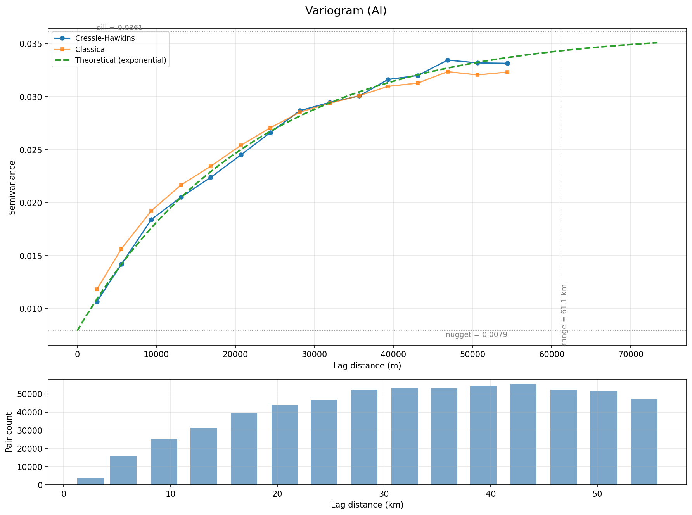
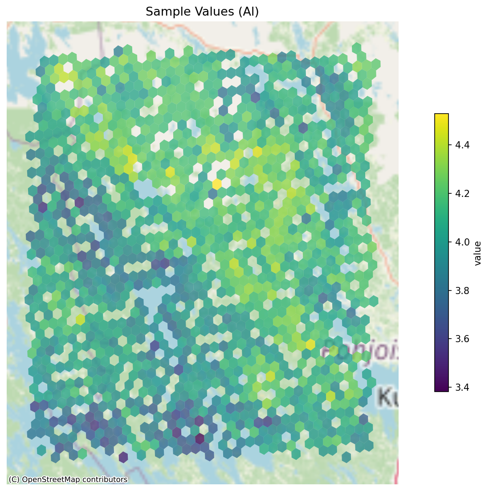
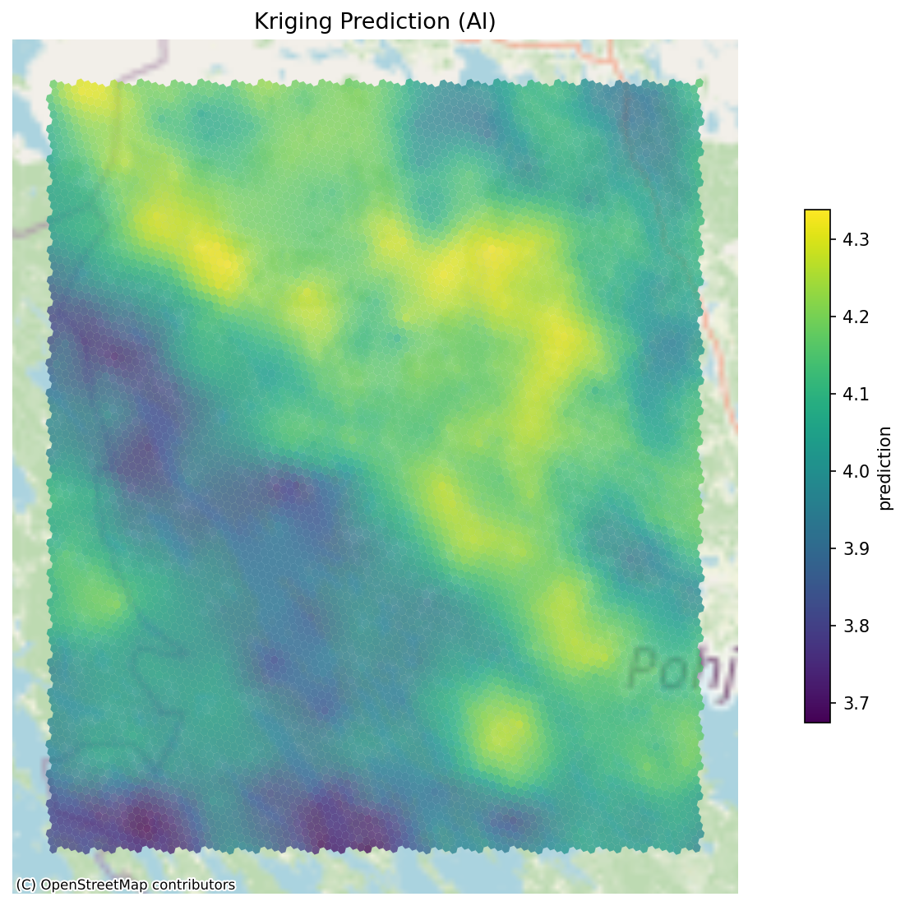
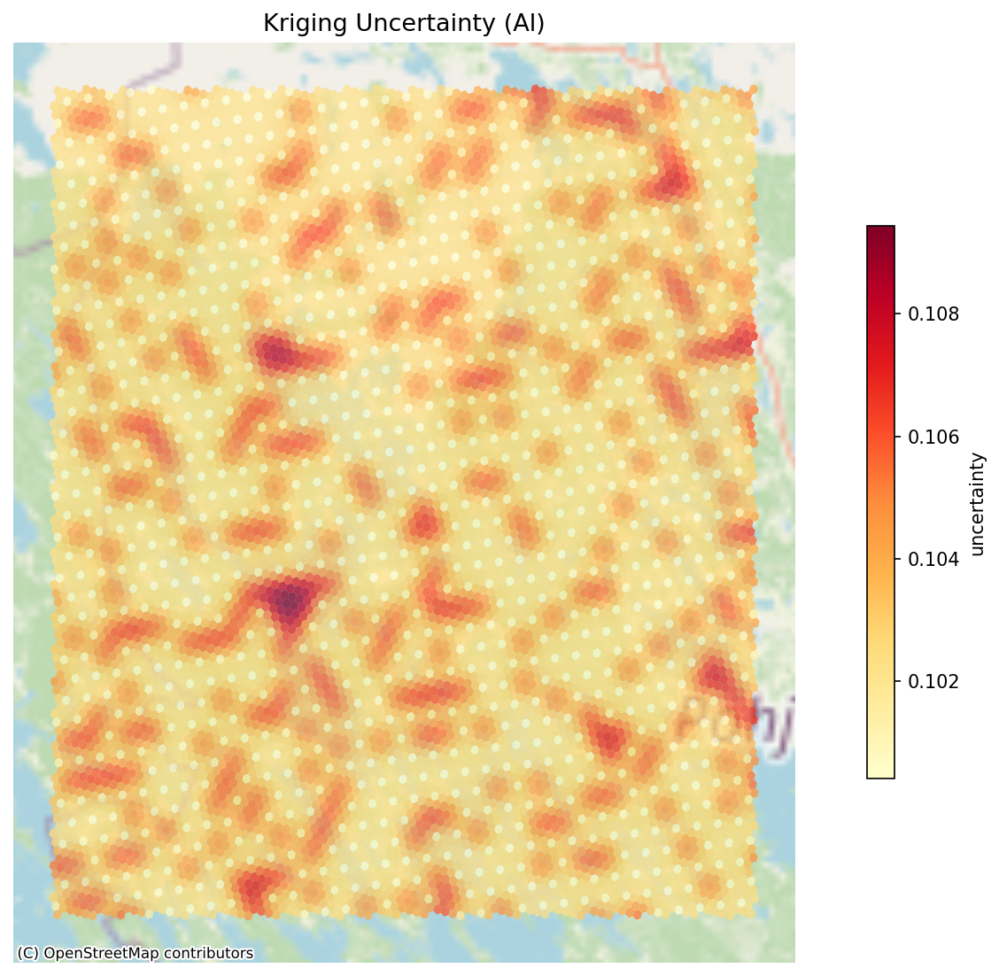

# Kriging OSM — Results

Ordinary kriging interpolation of **Aluminium (Al)** in till samples from the Finnish geochemistry database. Data is fetched from the CH API, aggregated to H3 resolution 7 hexagons, and interpolated onto a finer resolution 8 prediction grid. Values are log10-transformed (log10 ppm).

## Pipeline summary

| Metric | Value |
|---|---|
| Raw rows fetched | 51,348 |
| After filter (sampletype 24, Al) | 1,626 |
| Aggregated H3 cells (res 7) | 1,308 |
| Prediction grid (res 8) | 9,416 cells |
| Best variogram model | Exponential |
| Nugget | 0.0079 |
| Sill | 0.0361 |
| Practical range | 61.1 km |
| R² | 0.996 |
| Total runtime | 4.2s |

## Variogram

The empirical variogram shows clear spatial structure: semivariance increases steadily from the nugget (~0.008) to the sill (~0.036) over a practical range of ~61 km. The exponential model provides an excellent fit (R² = 0.996). The low nugget-to-sill ratio (22%) indicates strong spatial correlation, meaning kriging can effectively interpolate between observations.

The bottom panel shows pair counts per lag bin — all bins have 3,000-53,000 pairs, providing robust semivariance estimates.

## Observation values

1,308 H3 resolution 7 hexagons with mean Al concentrations (log10 ppm). Values range from 3.38 to 4.53 (2,400 to 34,000 ppm). The spatial pattern shows higher Al concentrations in the central and northern parts of the study area, with lower values in the southeast.

## Kriging prediction

The ordinary kriging prediction surface on a resolution 8 grid (9,416 cells). The interpolation smooths the noisy observations into a continuous surface while preserving the main spatial trends. The prediction range (3.67 to 4.34 log10 ppm) is narrower than the observations — kriging naturally regresses toward the local mean in areas with sparse data.

## Kriging uncertainty

The kriging standard deviation map shows prediction reliability. Uncertainty ranges from 0.100 to 0.109 log10 ppm. The pattern reflects observation density: uncertainty is lowest in the central area where observations are densest (pale yellow), and highest in gaps between data clusters (red patches). The relatively narrow uncertainty range is a consequence of the high nugget-to-sill ratio — even near observations, the irreducible nugget component limits how low uncertainty can go.

